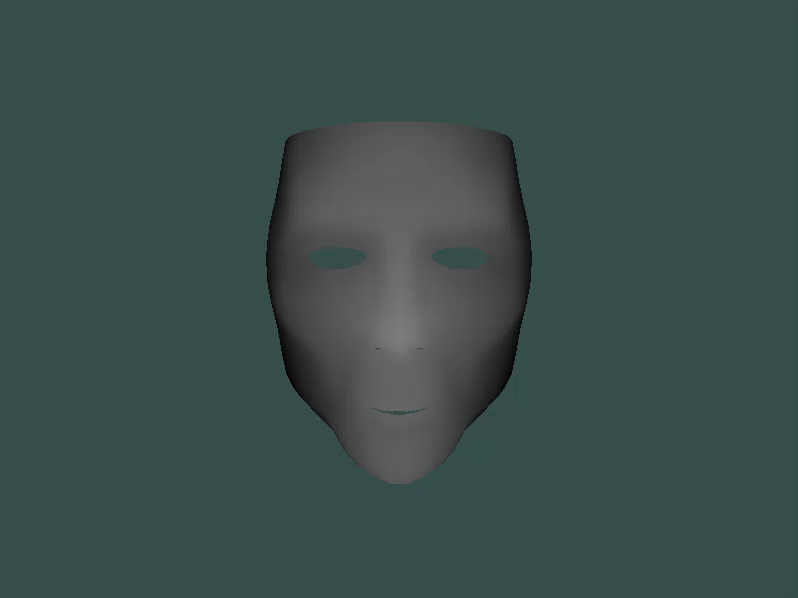
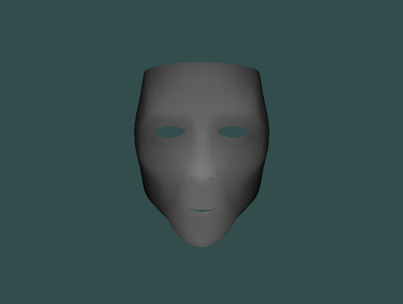
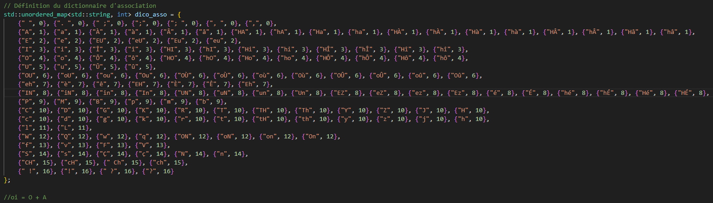
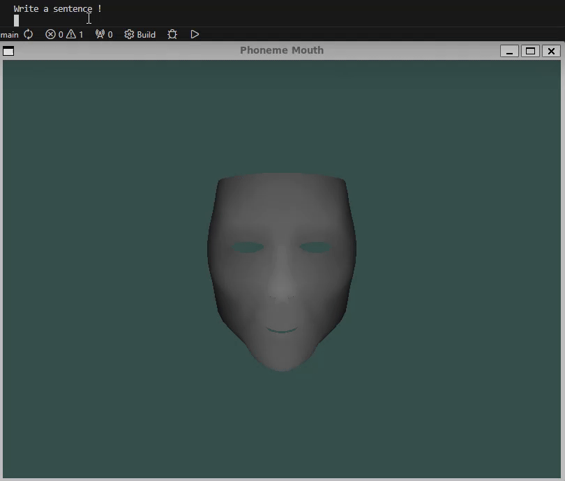
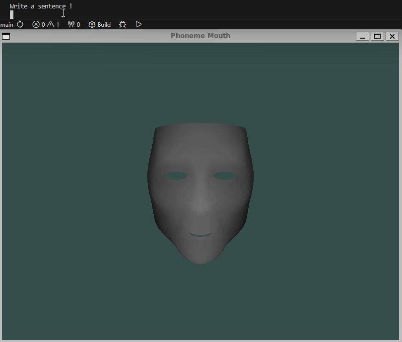
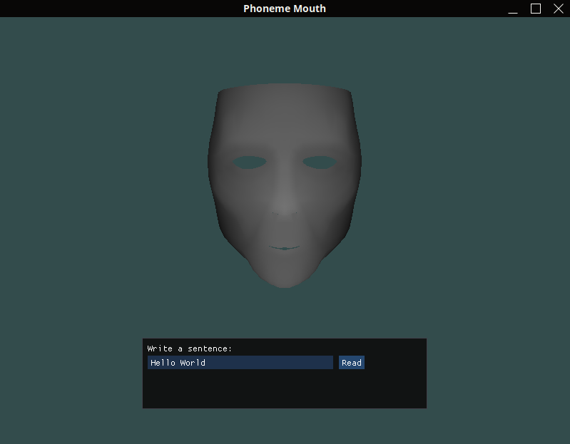
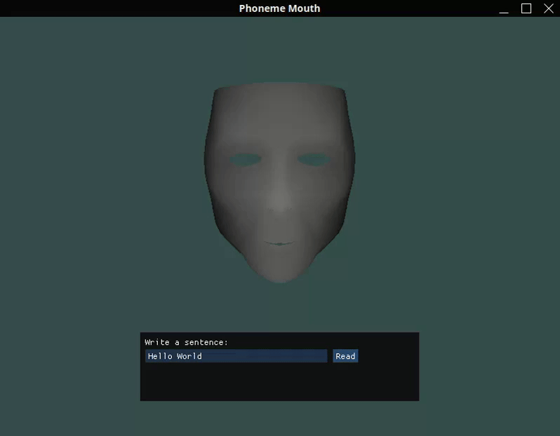
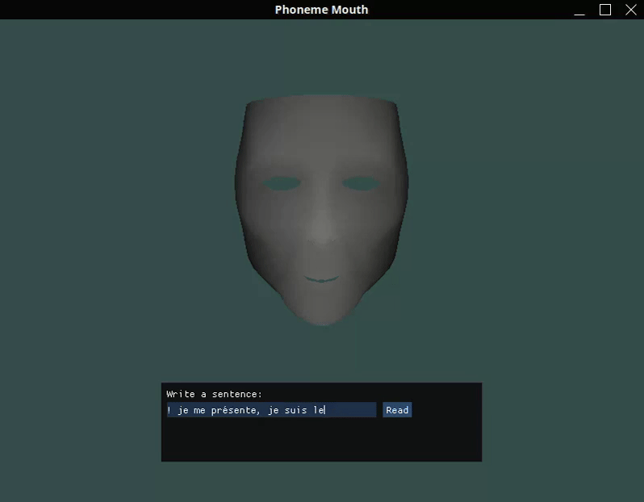
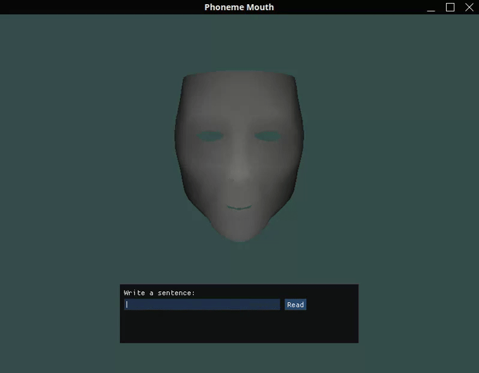

# Phoneme-Mask
Animating a Mask with different phonemes forms. 

### Here a sample of the animation (Phoneme A):

### Here the current mask displayed:

### Speaking to user input:
I had to choose a way to translate texts into phonemes, so I chose French pronounciation.

### Results:
Here are examples of sentences red by the mask !

### Better interaction with the user:
Using ImGui I added a window to get the user input directly in the window.
 \
Here are examples :

